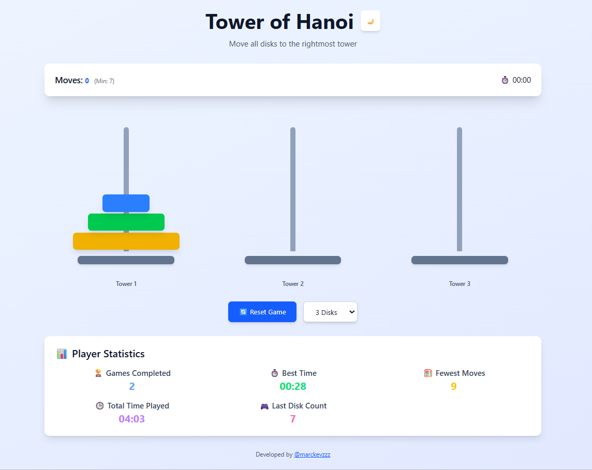
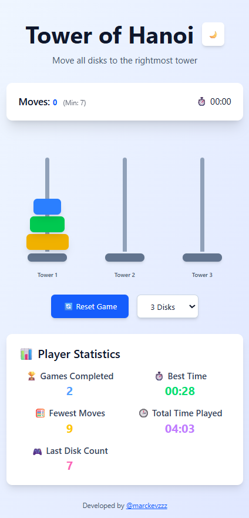
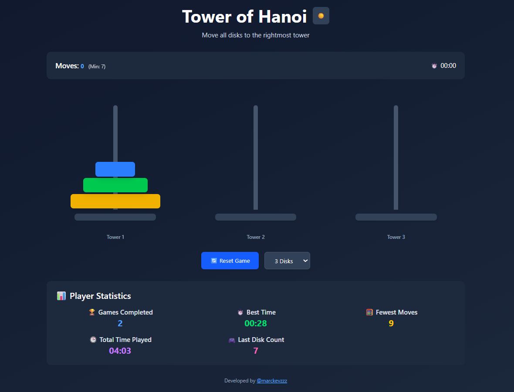
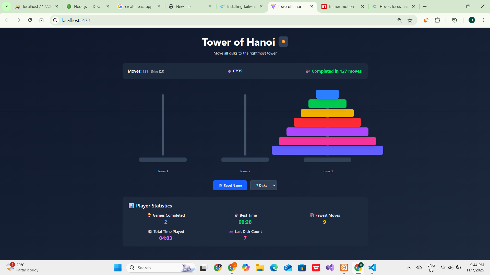

# Tower of Hanoi - React Game

A responsive and interactive Tower of Hanoi puzzle game built with **React** and **Framer Motion**. Move all disks from the leftmost tower to the rightmost tower while following the rules of the classic puzzle. Stats are tracked and saved in **localStorage**, including moves, elapsed time, and best score.

---

## 🎮 Features

- Fully **interactive Tower of Hanoi** game with smooth animations.
- **Responsive design** for mobile, tablet, and desktop screens.
- **Click anywhere on a tower** to select the top disk for easier control.
- **Top disk hover and selection effects** for better visual feedback.
- **Timer and move counter** that start automatically when the first move is made.
- **Local storage support** for:
  - Total moves
  - Elapsed time
  - Best score (fewest moves)
- Dark and light mode toggle.
- Reset game and disk count selector (3–7 disks).

---

## ⚙️ Technologies Used

- **React** – UI library for building components.
- **Framer Motion** – Animation library for smooth disk transitions.
- **Tailwind CSS** – Utility-first CSS framework for responsive and stylish UI.
- **LocalStorage** – For persistent stats tracking.

---

## 🖼️ Screenshots

### Desktop View

*The game in desktop view showing 5 disks on the towers.*

### Mobile View

*The game layout adapts to mobile screens, keeping disks and towers aligned.*

### Dark Mode

*Toggle between light and dark mode for better visibility and preference.*

### Completed Puzzle

*All disks successfully moved to the rightmost tower, showing the move count and timer.*

---

## 🎯 How to Play

1. Select a tower by clicking on it (or its top disk).  
2. Click another tower to move the disk there.  
3. Only a smaller disk can be placed on top of a larger disk.  
4. Repeat until all disks are moved to the rightmost tower.  
5. Try to complete the puzzle in the **minimum number of moves**.  

---

## 📐 Responsive Design

- The game layout adapts automatically to **mobile, tablet, and desktop** screen sizes.  
- Disk widths are calculated dynamically using `clamp()` and `vw` for smooth scaling.  
- Towers and disks remain aligned properly even with **7 disks**.  

---

## 💾 Persistent Stats

Stats are automatically saved in **localStorage**, including:  
- **Moves** – Number of moves made in the current game.  
- **Elapsed time** – Timer starts on the first move.  
- **Best score** – Fewest moves to complete the puzzle across sessions.  

---

## 🌙 Dark/Light Mode

- Click the **sun/moon icon** to toggle between dark and light mode.  
- UI colors, disks, and text adapt accordingly.  

---

## 🔄 Reset Game & Disk Selector

- Use the **Reset Game** button to restart the current game.  
- Select the number of disks (**3–7**) to change the puzzle difficulty.  

---

## 🏆 Credits

- Developed by [@marckvzz](https://github.com/marckvzz)  
- Inspired by the classic Tower of Hanoi puzzle.  

---

## 📄 License

This project is open-source and available under the **MIT License**.
